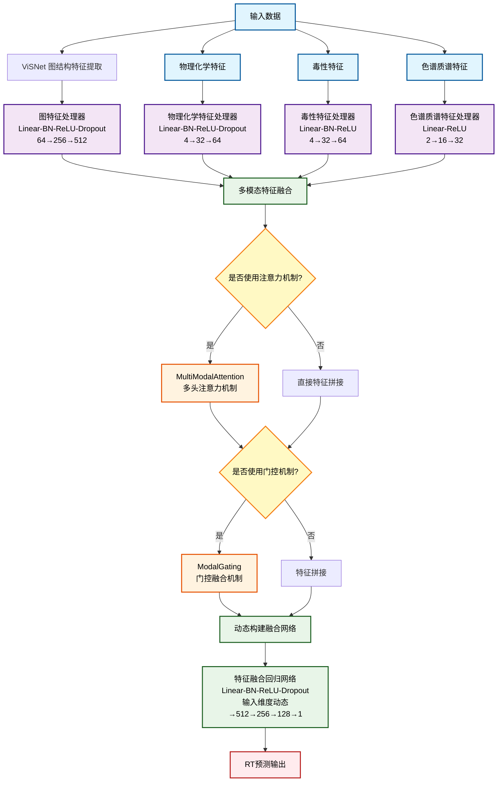

根据您提供的代码，我来绘制VisNetV2模型的Mermaid框架图：

## 模型组件详细说明：

### 1. 输入模块
- **图结构数据** (z, pos, batch)
- **物理化学特征** (4维)
- **毒性特征** (4维) 
- **色谱质谱特征** (2维)

### 2. 特征处理模块
- **ViSNet**: 图神经网络，提取分子3D结构特征
- **四个特征处理器**: 分别处理不同类型的特征，包含BN、ReLU、Dropout等

### 3. 融合机制模块
- **MultiModalAttention**: 可选的多头注意力机制，动态调节各模态重要性
- **ModalGating**: 可选的门控机制，学习特征融合权重
- **动态融合网络**: 根据实际提供的特征动态构建网络结构

### 4. 输出模块
- **回归预测**: 输出单个RT值，用于保留时间预测

这个框架展示了VisNetV2的多模态、模块化设计特点，支持灵活的特征组合和可选的注意力/门控机制。