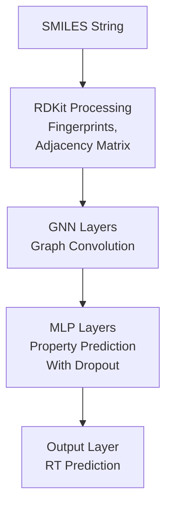
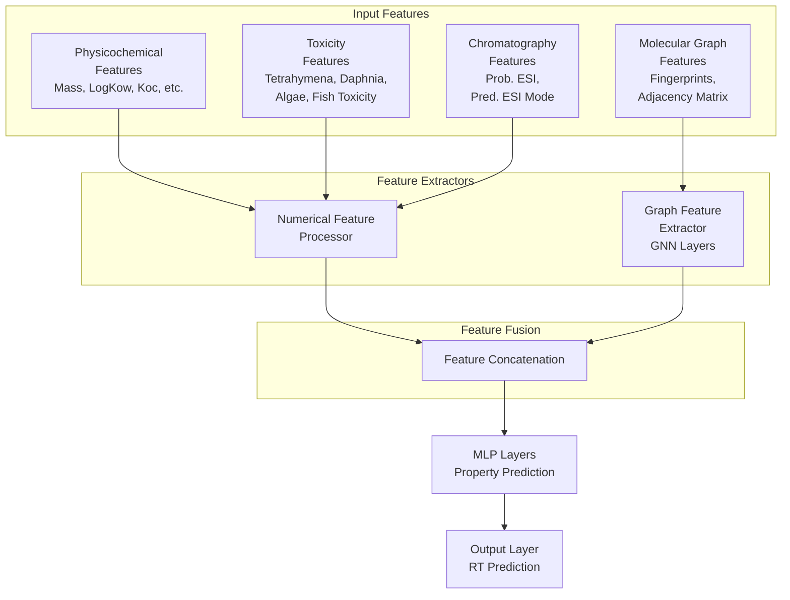

# GNN模型扩展框架设计与计划

## 1. 概述

当前的GNN模型仅使用分子图结构特征（原子指纹和邻接矩阵）进行训练，但数据集中包含了丰富的其他特征，如物理化学性质、毒性数据和色谱质谱特征。本框架旨在扩展模型以利用这些额外特征，提高预测性能，并通过SHAP值分析各特征对模型性能的贡献。

## 2. 当前模型分析

### 2.1 现有模型结构
- 输入：SMILES字符串转换为分子图（原子指纹和邻接矩阵）
- 输出：保留时间（RT）预测值
- 模型：基于分子指纹的图神经网络

### 2.2 数据集特征分析
根据task-1.md和数据集文件，可用特征包括：

1. **分子结构特征**（当前已使用）
   - 原子指纹（fingerprint）
   - 邻接矩阵（adjacency matrix）

2. **物理化学特征**（未使用）
   - 质量相关：单同位素质量、平均质量、M+H+、M-H-
   - 疏水性：logKow_EPISuite、Exp_logKow_EPISuite、alogp_ChemSpider、xlogp_ChemSpider
   - 吸附性：Koc实验与预测值

3. **毒性特征**（未使用）
   - Tetrahymena_pyriformis_toxicity
   - Daphnia_toxicity
   - Algae_toxicity
   - Pimephales_promelas_toxicity

4. **色谱质谱特征**（未使用）
   - Prob. +ESI, Prob. -ESI
   - Pred. ESI mode

5. **目标变量**
   - Pred_RTI_Positive_ESI 或 Pred_RTI_Negative_ESI（根据训练集类型）

## 3. 模型架构对比

### 3.1 当前模型架构



### 3.2 扩展后模型架构



### 3.3 模型实现对比

#### 3.3.1 基础模型 (base_model.py)
- 类名: `MolecularGraphNeuralNetwork`
- 核心组件:
  - `embed_fingerprint`: 原子指纹嵌入层
  - `W_fingerprint`: 图神经网络隐藏层
  - `W_output`: 多层感知机输出层
  - `W_property`: 属性预测层
  - `dropout`: 可选的dropout层（用于正则化）

- 特点:
  - 仅处理分子图结构特征（指纹和邻接矩阵）
  - 包含维度一致性检查
  - 支持dropout正则化
  - 使用标准GNN架构

#### 3.3.2 扩展模型 (extended_model.py)
- 类名: `ExtendedMolecularGraphNeuralNetwork`
- 核心组件:
  - 继承了基础模型的所有组件
  - `additional_features_processor`: 额外特征处理模块
  - 支持融合分子图特征和数值特征

- 特点:
  - 可处理额外数值特征（物理化学、毒性等）
  - 动态调整输出层输入维度以适应额外特征
  - 额外特征通过专门的处理模块进行处理
  - 将分子特征和额外特征连接后输入MLP层

#### 3.3.3 主要差异对比

| 特性 | 基础模型 | 扩展模型 |
|------|----------|----------|
| 类名 | `MolecularGraphNeuralNetwork` | `ExtendedMolecularGraphNeuralNetwork` |
| 额外特征支持 | ❌ 不支持 | ✅ 支持 |
| Dropout正则化 | ✅ 支持 | ❌ 不支持 |
| 维度检查 | ✅ 包含详细检查 | ❌ 基本检查 |
| 额外特征处理 | ❌ 无 | ✅ `additional_features_processor`模块 |
| 输出层输入维度 | 固定为`dim` | 可变，`dim + additional_features_dim` |

## 4. 框架设计方案

### 4.1 模型架构扩展

我们将采用多模态融合的方法来整合不同类型的特征：

```
物理化学特征 ──┐
毒性特征 ──────┤
色谱质谱特征 ──┼──> 特征融合层 ──> MLP层 ──> 输出
分子图特征 ────┘
```

### 4.2 技术实现方案

#### 4.2.1 特征提取模块
1. **分子图特征提取器**（保持现有GNN结构）
2. **数值特征提取器**（处理物理化学、毒性、色谱质谱特征）

#### 4.2.2 特征融合策略
1. **拼接融合**：将所有特征向量拼接后输入MLP
2. **注意力融合**：使用注意力机制动态加权不同特征
3. **门控融合**：使用门控机制控制不同特征的信息流

#### 4.2.3 模型输出层
- 保持回归任务的输出结构
- 支持不确定性估计（可选）

### 4.3 数据处理流程

```python
# 伪代码表示
def create_extended_dataset(filename, path, dataname):
    # 1. 读取原始数据
    df = pd.read_csv(os.path.join(path, filename))
    
    # 2. 为每种特征类型创建提取函数
    physchem_features = extract_physchem_features(df)
    toxicity_features = extract_toxicity_features(df)
    chromatography_features = extract_chromatography_features(df)
    
    # 3. 保持原有的分子图特征提取
    graph_features = extract_graph_features(df['SMILES'])
    
    # 4. 组合所有特征
    extended_dataset = combine_features(
        graph_features, 
        physchem_features, 
        toxicity_features, 
        chromatography_features,
        df['target_variable']
    )
    
    return extended_dataset
```

## 5. SHAP值分析计划

### 5.1 SHAP集成方案
1. **模型兼容性**：确保扩展后的模型支持SHAP分析
2. **特征重要性评估**：
   - 全局特征重要性排序
   - 单样本特征贡献分析
   - 不同化合物类别间的特征重要性比较

### 5.2 SHAP实施步骤
1. 训练扩展模型
2. 使用SHAP库计算特征贡献值
3. 可视化分析结果
4. 生成特征重要性报告

## 6. 实施计划

### 6.1 第一阶段：数据处理扩展（1-2周）
- [ ] 扩展preprocess.py以处理额外特征
- [ ] 实现特征标准化和缺失值处理
- [ ] 创建新的数据加载函数

### 6.2 第二阶段：模型架构扩展（2-3周）
- [ ] 设计并实现多模态融合模型
- [ ] 实现不同的特征融合策略
- [ ] 集成到现有训练流程

### 6.3 第三阶段：SHAP集成（1周）
- [ ] 集成SHAP库
- [ ] 实现特征重要性分析
- [ ] 创建可视化工具

### 6.4 第四阶段：性能评估与优化（1-2周）
- [ ] 对比新旧模型性能
- [ ] 分析各特征贡献度
- [ ] 优化模型参数

## 7. 预期收益

1. **模型性能提升**：利用更丰富的特征信息提高预测准确性
2. **可解释性增强**：通过SHAP分析了解各特征对预测的贡献
3. **特征选择指导**：识别对预测最有价值的特征，为后续研究提供方向
4. **模型泛化能力**：通过多特征融合提高模型在不同化合物类型上的表现

## 8. 风险与挑战

1. **过拟合风险**：增加特征数量可能导致过拟合，需要适当的正则化
2. **计算复杂度**：模型复杂度增加，训练时间可能延长
3. **数据质量**：部分特征可能存在缺失值或噪声，需要预处理
4. **特征相关性**：某些特征可能存在高度相关性，影响模型稳定性

## 9. 性能评估指标

1. **回归指标**：
   - MAE（平均绝对误差）
   - RMSE（均方根误差）
   - R²（决定系数）
   - PCC（皮尔逊相关系数）

2. **特征重要性指标**：
   - SHAP值分布
   - 特征重要性排序稳定性
   - 不同特征组合的性能对比

## 10. 结论

通过扩展GNN模型以利用数据集中的丰富特征，并结合SHAP分析，我们可以：
1. 显著提高RT预测的准确性
2. 获得对模型决策过程的深入理解
3. 为后续的分子设计和优化提供有价值的指导