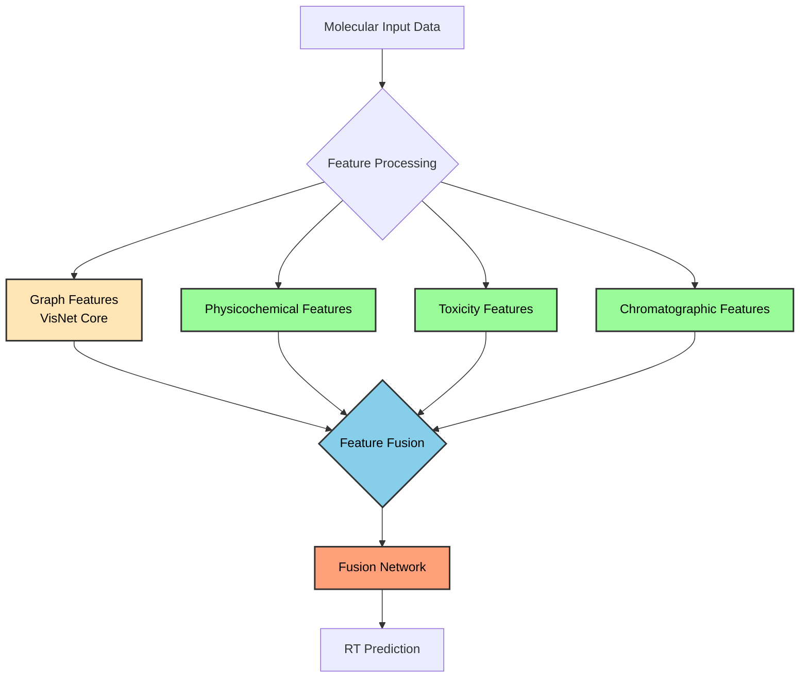
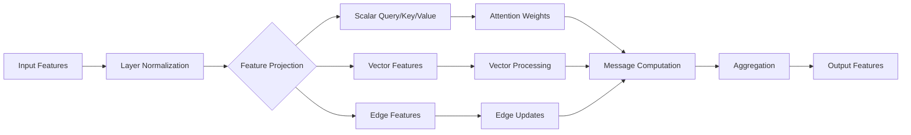
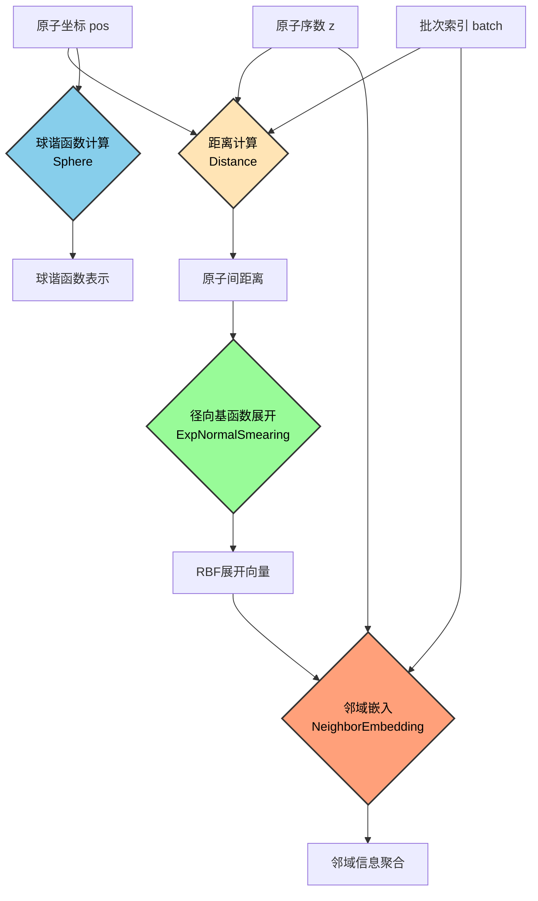
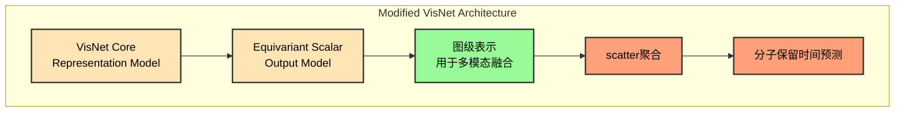
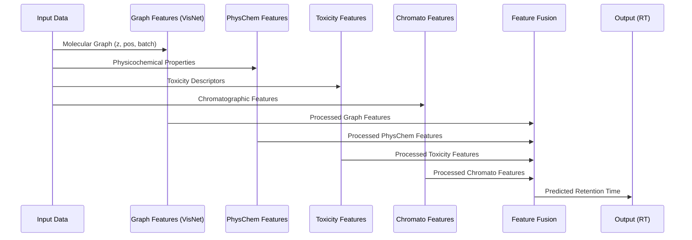

# VisNet V2 模型架构与工作流程说明

## 1. 整体架构概述

VisNet V2是一个多模态的保留时间(Retention Time, RT)预测模型，它在原始VisNet的基础上进行了大量改进和扩展，整合了多种分子特征以提高预测准确性。该模型能够处理来自分子图结构、物理化学性质、毒性特征和色谱特征等多种类型的数据。

## 2. 核心模块详解

### 2.1 VisNet核心模块

VisNet核心模块是整个模型的基础，负责从分子图结构中提取几何特征。它基于equivariant vector-scalar交互消息传递机制，具有以下关键创新点：

#### ViS-MP消息传递机制

ViS-MP (Vector-Scalar Message Passing) 是VisNet的核心消息传递机制，它同时处理标量和矢量特征：

1. **标量特征处理**: 使用自注意力机制处理原子的标量特征
2. **矢量特征处理**: 利用球谐函数处理原子间的几何关系
3. **特征交互**: 通过门控机制实现标量和矢量特征的相互影响

#### 几何特征计算

VisNet通过以下步骤计算分子的几何特征：

1. **距离计算**: 使用[Distance](../../models/visnet_core.py#L239-L271)模块计算原子间的距离
2. **径向基函数展开**: 通过[ExpNormalSmearing](../../models/visnet_core.py#L74-L154)将距离映射到高维空间
3. **球谐函数计算**: 使用[Sphere](../../models/visnet_core.py#L157-L209)模块计算原子间方向的球谐函数表示
4. **邻域嵌入**: 通过[NeighborEmbedding](../../models/visnet_core.py#L325-L379)聚合邻居原子的信息

几何特征计算流程如下：

#### 对VisNet的改进

我们在原始VisNet的基础上进行了关键改进，特别是在输出层处理方面：

**图级表示提取**: 在[EquivariantScalar](../../models/visnet_core.py#L741-L770)模块的[pre_reduce](../../models/visnet_core.py#L979-L996)方法中，我们在倒数第二层输出网络后添加了图级表示提取功能，用于后续的多模态特征融合。

这些改进使得VisNet能够更好地与外部特征融合，为VisNet V2的多模态架构提供了基础。

### 2.2 多特征融合模块

VisNet V2引入了多种额外的分子特征，并通过灵活的模块化设计支持不同的特征组合：

#### 物理化学特征 (Physicochemical Features)
- 维度: 4
- 处理模块: [physchem_processor](../../models/visnet_v2.py#L119-L130)
- 特征掩码支持: 可通过[physchem_feature_mask](../../models/visnet_v2.py#L59-L59)选择特定特征

#### 毒性特征 (Toxicity Features)
- 维度: 4
- 处理模块: [toxicity_processor](../../models/visnet_v2.py#L134-L148)
- 特征掩码支持: 可通过[toxicity_feature_mask](../../models/visnet_v2.py#L63-L63)选择特定特征

#### 色谱特征 (Chromatographic Features)
- 维度: 2
- 处理模块: [chromato_processor](../../models/visnet_v2.py#L152-L161)
- 特征掩码支持: 可通过[chromato_feature_mask](../../models/visnet_v2.py#L66-L66)选择特定特征

### 2.3 优化策略

VisNet V2实现了多种特征融合优化策略：

#### SHAP特征掩码 (Masking)
通过SHAP分析得到的特征重要性，可以使用特征掩码机制动态启用/禁用特定特征：
- 物理化学特征掩码: [physchem_feature_mask](../../models/visnet_v2.py#L59-L59)
- 毒性特征掩码: [toxicity_feature_mask](../../models/visnet_v2.py#L63-L63)
- 色谱特征掩码: [chromato_feature_mask](../../models/visnet_v2.py#L66-L66)

#### 模块维度调整 (Hidden-dim Strategy)
根据不同特征的重要性，可以调整各个处理模块的隐藏层维度：
- 图特征维度: [graph_hidden_dim](../../models/visnet_v2.py#L22-L22)
- 物理化学特征维度: [physchem_hidden_dim](../../models/visnet_v2.py#L23-L23)
- 毒性特征维度: [toxicity_hidden_dim](../../models/visnet_v2.py#L24-L24)
- 色谱特征维度: [chromato_hidden_dim](../../models/visnet_v2.py#L25-L25)

## 3. 工作流程

## 4. 模型特点总结

1. **模块化设计**: 支持不同特征级别的组合 (`graph`, `graph_physchem`, `graph_physchem_toxicity`, `all`)
2. **可扩展性**: 易于添加新的特征类型或处理模块
3. **灵活性**: 可根据需要启用或禁用特定特征类型
4. **可解释性**: 通过特征掩码机制支持SHAP分析指导的特征选择
5. **高性能**: 利用几何等变网络捕捉分子的3D结构信息
6. **改进的VisNet**: 对原始VisNet进行了关键改进，支持图级表示提取和双重输出机制