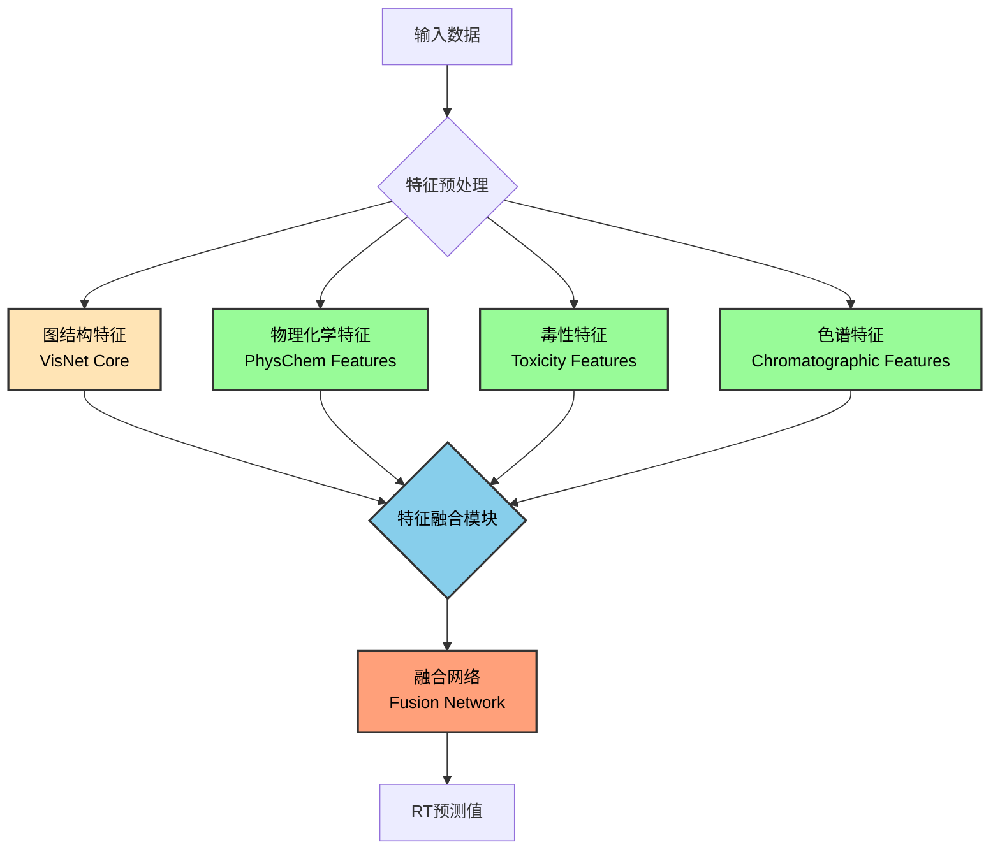
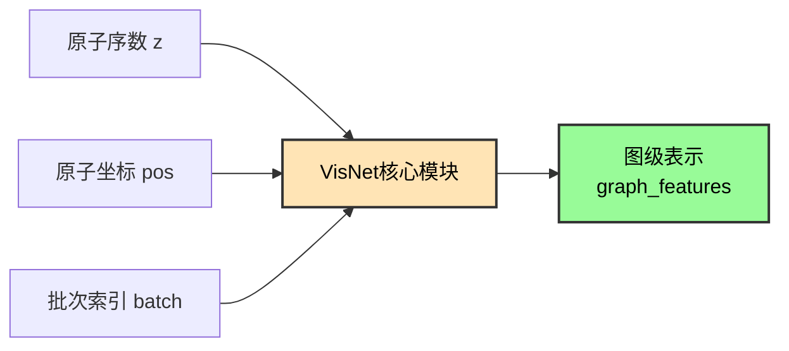
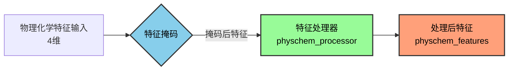
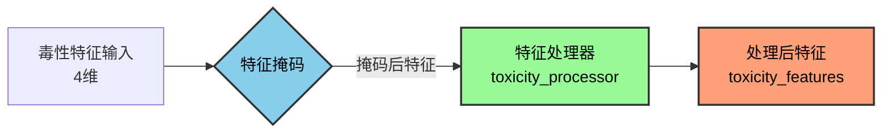
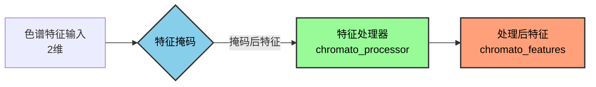
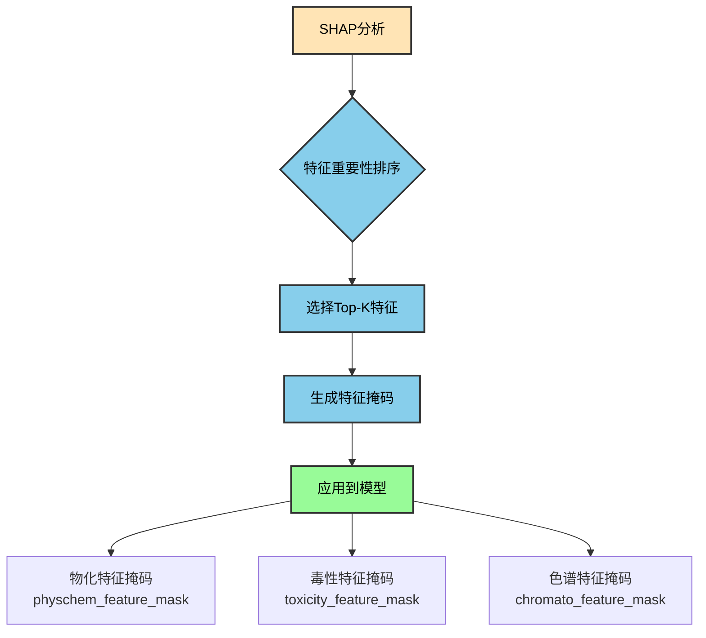
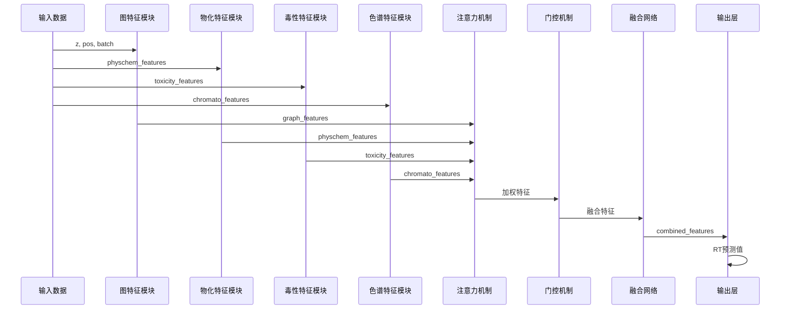
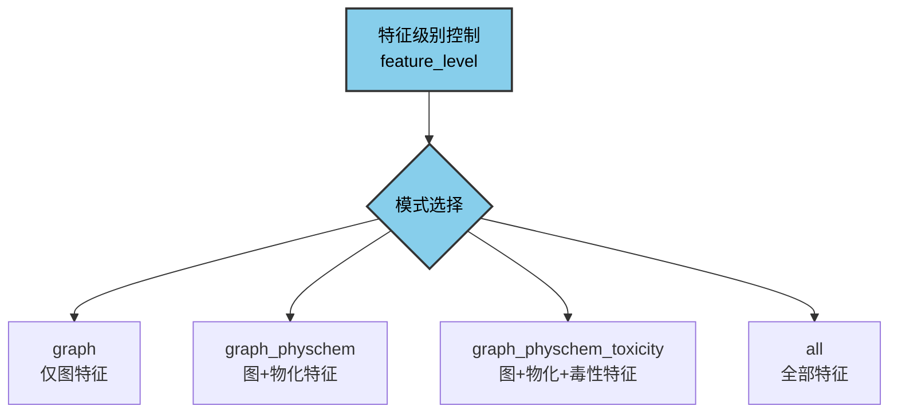

# VisNetV2 多特征融合与优化策略说明

## 1. 多模态特征融合路径

VisNetV2采用模块化设计，支持多种类型特征的融合。以下是完整的特征处理流程：



## 2. 各模态特征处理详情

### 2.1 图结构特征 (Graph Features)

图结构特征是模型的核心，通过VisNet核心模块提取分子的3D几何信息：



### 2.2 物理化学特征 (PhysChem Features)

物理化学特征包括分子层面的重要属性：



### 2.3 毒性特征 (Toxicity Features)

毒性特征反映化合物的潜在毒性属性：



### 2.4 色谱特征 (Chromatographic Features)

色谱特征来源于色谱实验数据：



## 3. SHAP特征掩码策略

通过SHAP分析可以评估各特征的重要性，进而通过掩码机制选择重要特征：



## 4. 模块维度调整策略

根据不同特征的重要性，可以调整各个处理模块的隐藏层维度：

```mermaid
graph TD
    A[模型配置] --> B{维度设置}
    
    B --> C[图特征维度<br/>graph_hidden_dim=512]
    B --> D[物化特征维度<br/>physchem_hidden_dim=64]
    B --> E[毒性特征维度<br/>toxicity_hidden_dim=64]
    B --> F[色谱特征维度<br/>chromato_hidden_dim=32]
    B --> G[融合网络维度<br/>fusion=[512,256,128]]
    
    style B fill:#87CEEB,stroke:#333,stroke-width:2px,color:#000
    style C fill:#98FB98,stroke:#333,stroke-width:2px,color:#000
    style D fill:#98FB98,stroke:#333,stroke-width:2px,color:#000
    style E fill:#98FB98,stroke:#333,stroke-width:2px,color:#000
    style F fill:#98FB98,stroke:#333,stroke-width:2px,color:#000
    style G fill:#FFA07A,stroke:#333,stroke-width:2px,color:#000
```

## 5. 完整前向传播流程



## 6. 特征级别控制

模型支持不同级别的特征组合：

