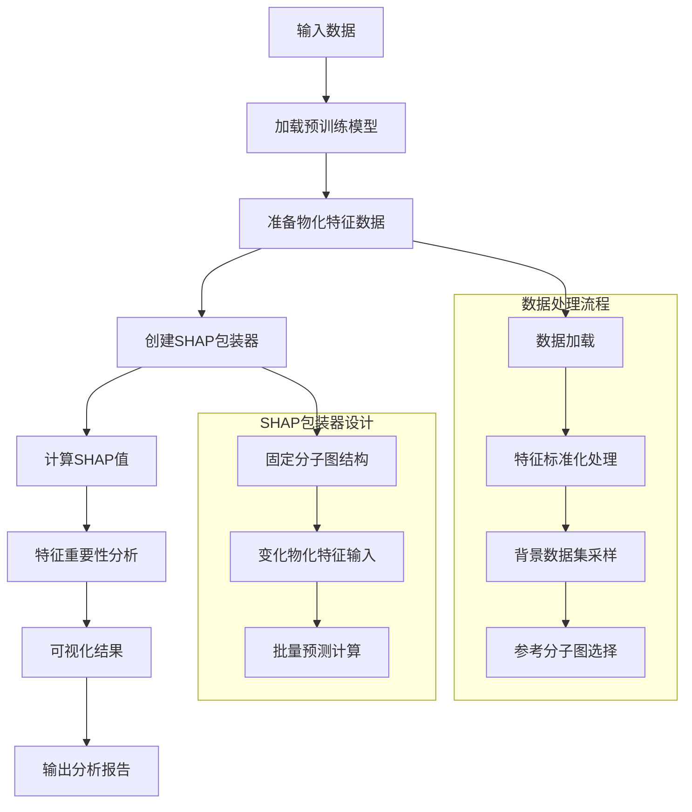
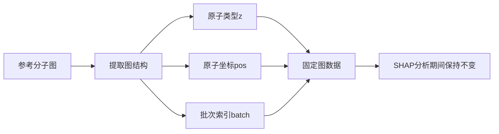

# VisNetV2 GNN回归模型SHAP分析技术文档

## 概述

本脚本实现了对VisNetV2图神经网络回归模型的SHAP（SHapley Additive exPlanations）分析，专门针对物化特征对模型预测的贡献度进行解释。

## 核心架构设计

### 1. 整体架构流程



### 2. 核心设计思路

#### 问题定义
- **目标**：解释GNN模型中4个物化特征对回归预测结果的贡献
- **挑战**：GNN包含图结构和物化特征双模态输入，需要隔离图结构影响
- **解决方案**：固定图结构，仅变化物化特征进行SHAP分析

## 核心代码实现详解

### 1. 模型包装器设计 - 关键

```python
class PhysChemSHAPWrapper:
    def __init__(self, model, fixed_graph_data, device, batch_size=32):
        self.model = model
        self.device = device
        # 固定图结构数据（原子类型、坐标、批次信息）
        self.fixed_z = fixed_graph_data['z'].to(device)
        self.fixed_pos = fixed_graph_data['pos'].to(device)
        self.fixed_batch = fixed_graph_data['batch'].to(device)
        
        # 获取模型标准化参数
        self.standardization_info = getattr(model, 'standardization_info', {})
        self.physchem_mean = np.array(self.standardization_info.get('physchem', {}).get('mean', [0, 0, 0, 0]))
        self.physchem_std = np.array(self.standardization_info.get('physchem', {}).get('std', [1, 1, 1, 1]))
```

#### 预测方法实现
```python
def predict(self, physchem_features):
    """核心预测方法：固定图结构，仅变化物化特征"""
    # 输入验证和类型转换
    if isinstance(physchem_features, np.ndarray):
        physchem_tensor = torch.FloatTensor(physchem_features).to(self.device)
    
    # 特征标准化处理（与训练时一致）
    if len(self.standardization_info) > 0:
        current_physchem = (current_physchem - torch.FloatTensor(self.physchem_mean).to(self.device)) / torch.FloatTensor(self.physchem_std).to(self.device)
    
    # 图结构数据扩展匹配批次大小
    n_atoms = self.fixed_z.shape[0]
    z = self.fixed_z.repeat(current_batch_size)
    pos = self.fixed_pos.repeat(current_batch_size, 1, 1).view(-1, 3)
    batch = torch.arange(current_batch_size, device=self.device).repeat_interleave(n_atoms)
    
    # 模型预测（处理BatchNorm特殊情形）
    with torch.no_grad():
        # 临时设置模型为评估模式
        was_training = self.model.training
        if was_training:
            self.model.eval()
        
        # 单样本BatchNorm特殊处理
        if current_batch_size == 1:
            for module in self.model.modules():
                if isinstance(module, nn.BatchNorm1d):
                    module.eval()
                    module.track_running_stats = True
        
        pred, _ = self.model(
            z=z, pos=pos, batch=batch,
            physchem_features=current_physchem
        )
    
    return pred.cpu().numpy()
```

### 2. SHAP值计算流程

```python
def compute_shap_values(model, physchem_features, reference_graph_data, device, background_samples=50):
    """
    SHAP值计算主流程
    """
    # 1. 特征标准化预处理
    standardization_info = getattr(model, 'standardization_info', {})
    processed_physchem_features = physchem_features.copy()
    
    if len(standardization_info) > 0:
        physchem_mean = np.array(standardization_info.get('physchem', {}).get('mean', [0, 0, 0, 0]))
        physchem_std = np.array(standardization_info.get('physchem', {}).get('std', [1, 1, 1, 1]))
        processed_physchem_features = (physchem_features - physchem_mean) / physchem_std
    
    # 2. 创建SHAP包装模型
    wrapped_model = PhysChemSHAPWrapper(model, reference_graph_data, device)
    
    # 3. 选择背景数据集
    background_data = processed_physchem_features[:min(background_samples, len(processed_physchem_features))]
    
    # 4. 初始化KernelExplainer
    explainer = shap.KernelExplainer(wrapped_model.predict, background_data)
    
    # 5. 计算SHAP值
    shap_values = explainer.shap_values(processed_physchem_features)
    
    return shap_values, explainer
```

### 3. 数据处理流程

#### 数据准备函数
```python
def prepare_physchem_data(dataset, preprocessed_data, sample_size=100):
    """准备物化特征数据用于SHAP分析"""
    # 随机采样
    indices = np.random.choice(len(dataset), min(sample_size, len(dataset)), replace=False)
    
    physchem_features = []
    smiles_list = []
    
    for i in indices:
        smiles = dataset[i][0]  # 获取SMILES
        if smiles in preprocessed_data:
            data_entry = preprocessed_data[smiles]
            if 'physchem_features' in data_entry and data_entry['physchem_features'] is not None:
                # 特征数据格式统一处理
                feat = data_entry['physchem_features']
                if isinstance(feat, list):
                    feat = np.array(feat)
                elif isinstance(feat, torch.Tensor):
                    feat = feat.numpy()
                
                physchem_features.append(feat)
                smiles_list.append(smiles)
    
    return np.stack(physchem_features), smiles_list
```

### 4. 特征重要性分析

```python
def analyze_feature_importance(shap_values, feature_names, output_dir):
    """
    基于SHAP值的特征重要性分析
    """
    # 计算平均绝对SHAP值作为重要性指标
    mean_abs_shap = np.mean(np.abs(shap_values), axis=0)
    
    # 构建特征重要性字典
    feature_importance = {}
    for i, name in enumerate(feature_names):
        feature_importance[name] = float(mean_abs_shap[i])
    
    # 重要性排序
    sorted_features = sorted(feature_importance.items(), key=lambda x: x[1], reverse=True)
    
    # 结果保存
    importance_data = {
        'feature_names': feature_names,
        'mean_abs_shap': mean_abs_shap.tolist(),
        'feature_ranking': sorted_features
    }
    
    with open(os.path.join(output_dir, 'shap_analysis_results.json'), 'w') as f:
        json.dump(importance_data, f, indent=2)
    
    return sorted_features
```

## 关键技术要点解析

### 1. 图结构固定策略



### 2. 特征标准化处理流程
```python
# 训练阶段标准化
training_std = (raw_features - training_mean) / training_std

# SHAP分析阶段保持一致性
shap_std = (shap_features - training_mean) / training_std

# 确保模型输入分布一致
```

### 3. BatchNorm层特殊处理
- **问题**：BatchNorm在单样本预测时统计量不稳定
- **解决方案**：
  - 临时设置为评估模式
  - 使用训练时累积的running_mean和running_var
  - 确保预测一致性

## 输出结果体系

### 1. 数据文件输出
```
shap_analysis_results/
├── feature_importance.json          # 特征重要性得分
├── shap_analysis_results.json       # 详细SHAP分析结果
├── runtime_info.json               # 运行时间统计
└── shap_analysis_args.json         # 命令行参数记录
```

### 2. 可视化输出
- **SHAP摘要图**：显示特征贡献分布和重要性
- **特征重要性条形图**：直观展示特征排名
- **依赖关系图**：特征值与SHAP值的关系（如实现）

