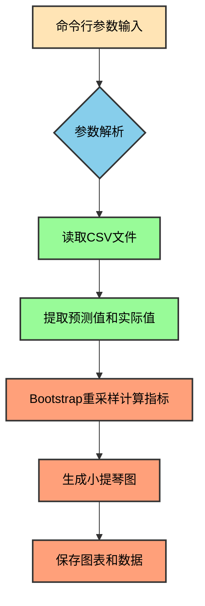

# 小提琴图生成工具说明

## 1. 工具概述

小提琴图生成工具 ([generate_violin_plot.py](../../scripts/plt/generate_violin_plot.py)) 是一个用于可视化和比较多个模型预测性能的脚本。它通过读取模型预测结果的CSV文件，计算R²和MAE指标的分布，并生成小提琴图进行可视化展示。

## 2. 基本原理

### 2.1 指标计算方法

工具使用Bootstrap重采样方法来估计R²和MAE指标的分布，这种方法相比单一值计算能更全面地反映模型性能：

1. **Bootstrap重采样**：
   - 从预测结果中随机抽取样本（允许重复）
   - 每次采样数量为总样本数的1/10或100（取较小值）
   - 重复1000次采样过程

2. **R²计算**：
   - 对每次采样计算决定系数R²
   - 公式：R² = 1 - (SS_res / SS_tot)
   - 其中SS_res是残差平方和，SS_tot是总平方和

3. **MAE计算**：
   - 对每次采样计算平均绝对误差
   - 公式：MAE = mean(|predicted - actual|)

### 2.2 可视化方法

使用matplotlib的violinplot函数绘制小提琴图：

1. **R²分布小提琴图**：
   - 展示各模型R²值的分布密度
   - 使用青绿色 (#66c2a5) 作为默认颜色

2. **MAE分布小提琴图**：
   - 展示各模型MAE值的分布密度
   - 使用紫色 (#8da0cb) 作为默认颜色

3. **样式设置**：
   - 所有颜色使用alpha=0.7透明度
   - 显示均值和中位数
   - 添加网格线增强可读性

## 3. 工作流程



## 4. 使用方法

### 4.1 命令行参数

```bash
python scripts/plt/generate_violin_plot.py \
  --csv_files <文件路径列表> \
  --labels <标签列表> \
  --output_dir <输出目录>
```

- `--csv_files`: 预测结果CSV文件路径列表（必填）
- `--labels`: 每个文件对应的标签（可选，默认使用文件名）
- `--output_dir`: 输出目录（可选，默认生成带时间戳的目录）

### 4.2 示例用法

```bash
# 正离子模型比较
cd d:\Projects\python\gnn-rt-1; python scripts/plt/generate_violin_plot.py \
  --csv_files predictions/prediction_20251126-193532/MMF_GNN_pos_predictions.csv \
               predictions/prediction_20251126-191743/test_MMF_GNN_pos_predictions.csv \
  --labels "GNN-RT" "VisNet-V2"

# 负离子模型比较
cd d:\Projects\python\gnn-rt-1; python scripts/plt/generate_violin_plot.py \
  --csv_files predictions/gnn-rt/neg-prediction_20251127-001446/MMF_GNN_neg_predictions.csv \
               predictions/visnet-v2/neg-3-best-prediction_20251126-205533/test_MMF_GNN_neg_predictions.csv \
  --labels "GNN-RT" "VisNet-V2"
```

## 5. 输出内容

工具会在指定的输出目录中生成以下内容：

1. **小提琴图** (`comparison_violin_metrics.png`)：
   - 包含R²和MAE两个子图
   - 显示各模型的指标分布情况
   - 标注样本数量信息

2. **数据文件** (`violin_plot_data.json`)：
   - 包含生成图表的所有原始数据
   - 便于后续分析和复现

## 6. 设计规范

该工具遵循项目的设计规范：

1. **可视化规范**：
   - 所有文本内容使用英文标签
   - 图表中显示有效数据点数量
   - 使用指定的颜色方案和透明度

2. **输出规范**：
   - 结果保存在带时间戳的独立文件夹中
   - 默认输出目录为 `results/violin/`
   - 同时保存图表和原始数据